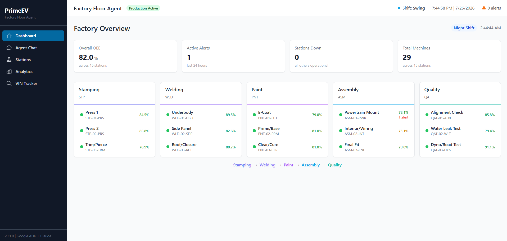
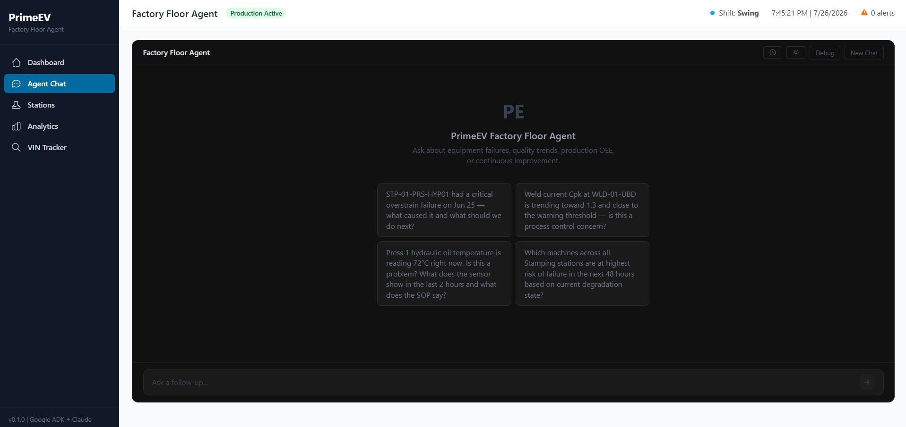
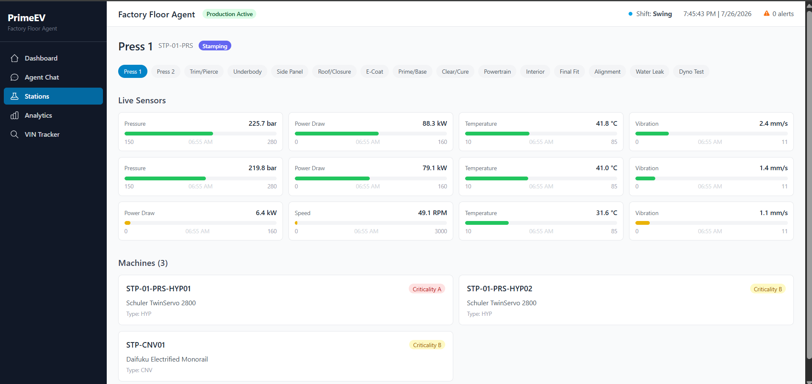
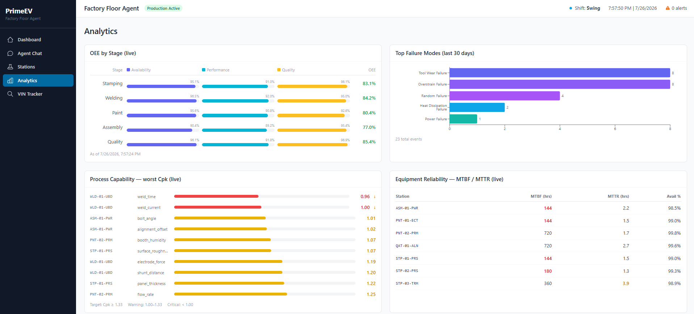
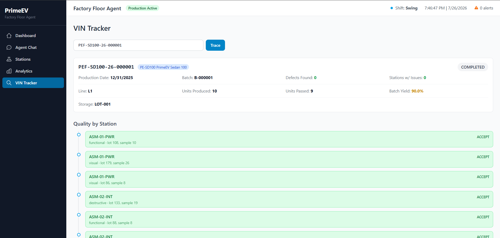
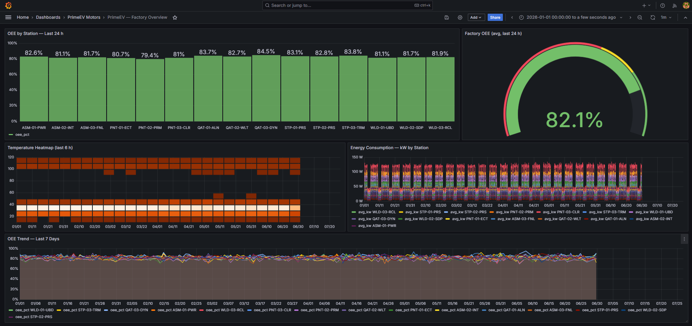
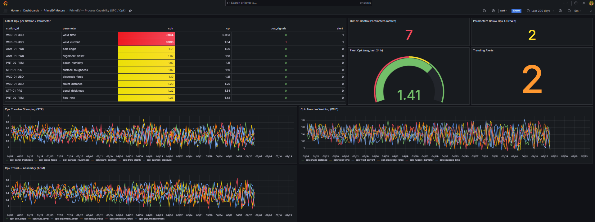
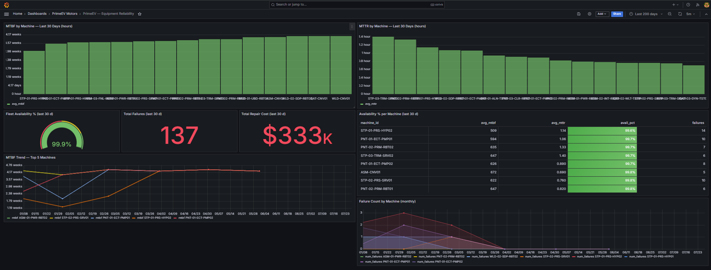
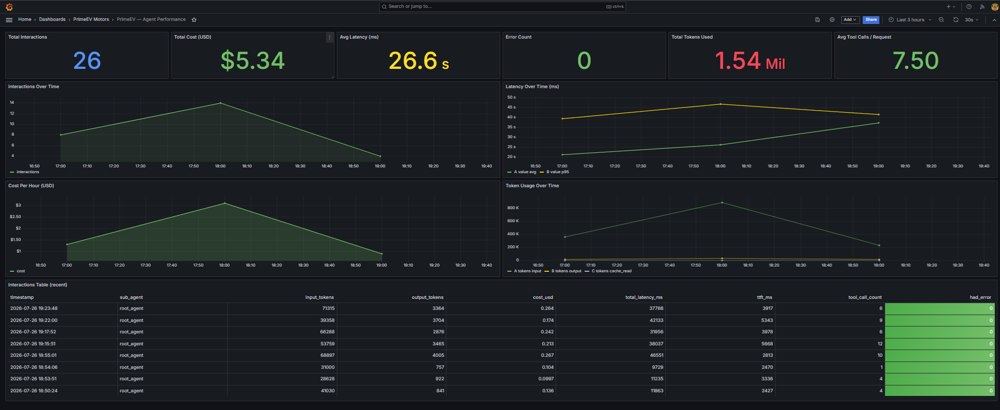

# PrimeEV Motors — Factory Floor AI Agent

Production-grade multi-agent AI system that helps manufacturing engineers **diagnose, decide, and act** on an electric vehicle (EV) assembly factory floor.

Built with **Google ADK (Agent Development Kit)** · **Claude Haiku 4.5** (Anthropic) · **PostgreSQL** · **ClickHouse** · **Kafka** · **React** · **Prometheus/Grafana**

---

## Demo

https://github.com/user-attachments/assets/factory_agent_video.mp4

---

## Screenshots

### App

| Dashboard | Agent Chat |
|-----------|------------|
|  |  |

| Stations — Live Sensors | Analytics |
|-------------------------|-----------|
|  |  |

**VIN (Vehicle Identification Number) Tracker** — full quality history per vehicle across every station



### Grafana

| Factory Overview | Process Capability — SPC (Statistical Process Control) / Cpk (Process Capability Index) |
|-----------------|-------------------------------|
|  |  |

| Equipment Reliability — MTBF (Mean Time Between Failures) / MTTR (Mean Time To Repair) | Agent Performance |
|------------------------------------|-------------------|
|  |  |

---

## Architecture

```
                         User Query
                             │
                             ▼
                    ┌─────────────────┐
                    │   Root Agent    │  Google ADK + Claude Haiku 4.5
                    │   (Router)      │
                    └────────┬────────┘
                             │
         ┌───────────────────┼───────────────────────────────┐
         ▼           ▼              ▼         ▼              ▼
 ┌─────────────┐ ┌──────────┐ ┌──────────┐ ┌────────┐ ┌─────────┐
 │  Equipment  │ │ Quality  │ │Production│ │Improve-│ │ Action  │
 │  Agent      │ │  Agent   │ │  Agent   │ │ment    │ │  Agent  │
 │  (19 tools) │ │(21 tools)│ │(20 tools)│ │ (13)   │ │  (11)   │
 └──────┬──────┘ └────┬─────┘ └────┬─────┘ └───┬────┘ └────┬────┘
        │             │            │           │           │
        └─────────────┼────────────┼───────────┘           │
                      ▼            ▼                       ▼
         ┌─────────────────────────────┐        ┌──────────────────┐
         │      Agent Tools (~48)      │        │   Action Tools   │
         └──────┬──────┬──────┬────────┘        │ (work orders,    │
                │      │      │                 │  8D, NCR, PDCA)  │
                ▼      ▼      ▼                 └──────────────────┘
         ┌────────┐ ┌──────┐ ┌────────┐
         │Postgres│ │Click │ │Chroma  │
         │(25 tbl)│ │House │ │DB (RAG)│
         └────────┘ │(7tbl)│ └────────┘
                    └──┬───┘
                       │
              ┌────────┴────────┐
              │ Kafka Streaming │
              │ (live sensors)  │
              └─────────────────┘
```

---

## Factory Domain

**PrimeEV Motors** — fictional EV original equipment manufacturer (OEM), plant code `PE-FRE`. 5-stage assembly line, 15 stations, ~30 machines, 3 vehicle models, ~80 vehicles/day, 3 shifts.

### Stages, Stations & Defect Types

| Stage | Station ID | Station Name | Key Operations | Station-Specific Defects |
|-------|-----------|--------------|----------------|--------------------------|
| **Stamping (STP)** | STP-01-PRS | Press 1 | Body panel forming | crack, wrinkle, thinning, springback, burr |
| | STP-02-PRS | Press 2 | Panel forming | split, surface scratch, galling, misalignment |
| | STP-03-TRM | Trim/Pierce | Trimming, hole piercing | slug pull, oversized hole, incomplete trim, edge burr |
| **Welding (WLD)** | WLD-01-UBD | Underbody | Underbody spot welding | weld spatter, incomplete fusion, porosity, burn-through, misalignment |
| | WLD-02-SDP | Side Panel | Side panel assembly | crack, undercut, cold lap, distortion |
| | WLD-03-RCL | Roof/Closure | Roof and closure welding | blow hole, lack of penetration, electrode wear mark |
| **Paint (PNT)** | PNT-01-ECT | E-Coat | Electro-deposition primer | thin coverage, bare spot, crater, drip |
| | PNT-02-PRM | Prime/Base | Primer and base coat | orange peel, color mismatch, fisheye, solvent pop |
| | PNT-03-CLR | Clear/Cure | Clear coat and oven cure | runs/sags, dust inclusion, haze, pinholes |
| **Assembly (ASM)** | ASM-01-PWR | Powertrain Mount | Battery, motor, drivetrain | torque out-of-spec, bolt missing, connector unseated, fluid leak |
| | ASM-02-INT | Interior/Wiring | Interior trim, harness routing | clip broken, panel gap, squeak/rattle, wiring misroute |
| | ASM-03-FNL | Final Fit | Closures, seals, trim | door alignment, hood gap, trunk seal, trim fit |
| **Quality/Test (QAT)** | QAT-01-ALN | Alignment Check | Wheel geometry check | wheel alignment out-of-spec, camber deviation, toe deviation |
| | QAT-02-WLT | Water Leak Test | Seal and bond integrity | seal failure, drain plug missing, glass bond gap |
| | QAT-03-DYN | Dyno/Road Test | Dynamic performance test | vibration at speed, brake noise, steering pull, warning light |

### Machines (~30)

| Machine Type | Code | Examples |
|-------------|------|---------|
| Hydraulic Press | HYP | Schuler TwinServo 2800 (STP-01-PRS) |
| Servo Press | SRV | Komatsu H2F 1600 (STP-02-PRS) |
| Robot | RBT | Fanuc R-2000iC, ABB IRB 5500, KUKA KR 1000, UR10e |
| Pump Unit | PMP | Graco E-Flo DC 2200 (e-coat) |
| Oven/Curing | OVN | Dürr EcoInCure 4.0 (PNT-03-CLR) |
| Test Equipment | TST | Hunter WA Series (alignment), Meidensha DYNAS3 (dyno) |
| Conveyor | CNV | Daifuku Electrified Monorail (per stage) |

Criticality A = mission-critical (no redundancy), B = redundant path available, C = non-critical.

### Sensors (9 types, ~180 sensors across 30 machines)

| Code | Sensor | Unit | Machine Types |
|------|--------|------|---------------|
| TMP | Temperature | °C | All |
| VIB | Vibration | mm/s | HYP, SRV, RBT, PMP, CNC, CNV |
| PRS | Pressure | bar | HYP, PMP |
| TRQ | Torque | Nm | SRV, RBT |
| RPM | Rotational Speed | rpm | SRV, CNC, CNV |
| PWR | Power Draw | kW | All |
| FLW | Flow Rate | L/min | PMP |
| CUR | Current | A | RBT |
| HUM | Humidity | % | OVN |

Sensor address format: `{MACHINE_ID}:{SENSOR_TYPE}` → e.g. `STP-01-PRS-HYP01:TMP`

### Failure Modes (AI4I-inspired)

| Code | Failure Mode | Typical Trigger |
|------|-------------|-----------------|
| TWF | Tool Wear Failure | Wear threshold crossed |
| HDF | Heat Dissipation Failure | High temp + high power draw |
| PWF | Power Failure | Torque × RPM exceeds power limit |
| OSF | Overstrain Failure | Process force exceeds tooling limits |
| RNF | Random Failure | Stochastic background rate |

### Vehicle Models & Components

**Models:** PE-SD100 (Sedan 100), PE-SV200 (SUV 200), PE-CP300 (Compact 300) — all model year 2026.

**VIN format:** `PEF-{MODEL}-{YY}-{SEQ:06d}` → e.g. `PEF-SD100-26-004521`

**Component categories — BOM (Bill of Materials) / MRP (Material Requirements Planning):**

| Code | Category | Examples |
|------|----------|---------|
| CHS | Chassis / Body Structure | Floor pan, side rails, roof panel |
| EXT | Exterior Panel | Hood, doors, fenders, trunk lid |
| INT | Interior Trim | Dashboard, seats, door panels |
| PWR | Powertrain | Motor assembly, gearbox, driveshaft |
| ELC | Electrical | Wiring harness, electronic control unit (ECU), sensors |
| BAT | Battery | Cell modules, battery management system (BMS), cooling plate |
| SUS | Suspension | Control arms, struts, subframe |
| BRK | Brake | Caliper, rotor, brake line |
| FST | Fastener | Bolts, clips, rivets |
| SEL | Sealant / Adhesive | Structural adhesive, weatherstrip |
| RAW | Raw Material | Steel coil, aluminium sheet, paint |

**Part number format:** `{CATEGORY}-{MODEL_CODE}-{SEQ:03d}` → e.g. `CHS-SD100-001`

### Suppliers (5)

| ID | Name | Category |
|----|------|----------|
| SUP-MTL01 | SteelWorks Inc. | Metals |
| SUP-MTL02 | AluForm Global | Aluminium |
| SUP-PLY01 | PolyTech Materials | Plastics / Rubber |
| SUP-ELC01 | VoltCell Energy | Battery / Wiring |
| SUP-CHM01 | CoatChem Solutions | Paint / Coatings |

### Production & Quality Thresholds

| Metric | Target | Warning | Unit |
|--------|--------|---------|------|
| OEE (Overall Equipment Effectiveness) | ≥ 75% | < 60% | % |
| Cpk | ≥ 1.33 | < 1.0 | — |
| MTBF | ≥ 500 h | < 200 h | hours |
| MTTR | ≤ 2 h | > 4 h | hours |
| Fleet Availability | ≥ 95% | — | % |
| Daily Output | 80 vehicles | — | units/day |

---

## Quick Start

### One-command boot (Docker)

```bash
# 1. Copy env file and add your Anthropic API key
cp .env.example .env
# Edit .env — set ANTHROPIC_API_KEY=sk-ant-...

# 2. Boot everything
docker compose up
```

On first boot the `datagen` service seeds 180 days of synthetic data and indexes the RAG corpus automatically. Subsequent `docker compose up` calls skip seeding.

| Service | URL |
|---------|-----|
| Dashboard (React) | http://localhost:3000 |
| API (FastAPI) | http://localhost:8000/docs |
| Grafana | http://localhost:3001 (admin / admin) |
| Prometheus | http://localhost:9090 |

### Manual setup (development)

```bash
pip install -e ".[dev]"
cd frontend && npm install && cd ..
docker compose up -d postgres clickhouse chroma zookeeper kafka prometheus grafana
python -m src.datagen generate --days 180 --seed 42
python -m src.rag.embedder --index-all
uvicorn src.api.main:app --reload --port 8000
cd frontend && npm run dev
```

### Run evals

```bash
# Offline framework tests (no API key, ~3 seconds)
pytest evals/ -v -k "not test_live_eval"

# Live agent eval (requires ANTHROPIC_API_KEY and running services)
pytest evals/ -v --live

# Live + LLM judge metrics (faithfulness, relevance)
pytest evals/ -v --live --llm-judge
```

---

## Tech Stack

| Layer | Technology | Purpose |
|-------|-----------|---------|
| Agent Framework | Google ADK 2.x | Multi-agent orchestration, tool routing |
| LLM (Large Language Model) | Claude Haiku 4.5 (Anthropic) | Reasoning, diagnosis, recommendations |
| Backend | FastAPI + SSE (Server-Sent Events) | API server with streaming chat |
| Frontend | React + TypeScript + Tailwind + recharts | Dashboard, chat UI, analytics |
| Operational DB | PostgreSQL 16 | Failures, work orders, inspections, BOMs (25 tables) |
| Analytics DB | ClickHouse 24.x | Sensor telemetry, OEE, SPC, reliability (~7 tables, ~25M rows) |
| Vector Store | ChromaDB | RAG (Retrieval-Augmented Generation) over SOPs (Standard Operating Procedures), manuals, FMEAs (Failure Mode and Effects Analysis), troubleshooting DB |
| Streaming | Apache Kafka | Live sensor feeds, real-time rolling Cpk |
| Monitoring | Prometheus + Grafana | Agent latency, tool calls, error rates, factory KPIs |
| CI/CD (Continuous Integration / Continuous Deployment) | GitHub Actions | Lint · type-check · test · eval on every PR |

---

## Agents & Tools

### Agent Routing

```
Root Agent  ──routes by intent──►  Equipment | Quality | Production | Improvement | Action
```

The root agent classifies every query and delegates to the appropriate sub-agent. Sub-agents call their tool set, optionally search the RAG corpus, then synthesize a response with cited evidence and a confidence score.

### Equipment Agent — 7 tool modules, 19 tools

| Module | Tools |
|--------|-------|
| `sensor_tools` | `fetch_sensor_data`, `get_sensor_trend`, `get_current_readings` |
| `failure_tools` | `get_failure_history`, `get_active_alerts`, `get_failure_by_id` |
| `maintenance_tools` | `get_maintenance_history`, `get_work_orders`, `create_work_order` |
| `reliability_tools` | `get_mtbf_mttr`, `get_reliability_report`, `get_degradation_status`, `get_failure_rate_trend` |
| `energy_tools` | `get_energy_consumption`, `get_energy_trend` |
| `inventory_tools` | `get_spare_parts` |
| `rag_tools` | `search_sop`, `search_equipment_manual`, `search_past_issues` |

Capabilities: root cause analysis, sensor diagnostics, Remaining Useful Life (RUL) / degradation tracking, MTBF/MTTR reporting, maintenance scheduling, spare parts checks.

### Quality Agent — 4 tool modules, 21 tools

| Module | Tools |
|--------|-------|
| `quality_tools` | `get_dimensional_results`, `get_sampling_results`, `get_visual_checklist`, `get_defect_rates`, `get_rework_history`, `get_defect_catalog`, `get_inspection_plan`, `get_aql_recommendation`, `get_measurement_specs` |
| `spc_tools` | `get_spc_data`, `get_cpk`, `get_process_capability`, `check_control_rules` |
| `supply_chain_tools` | `get_receiving_inspections`, `get_supplier_scorecard`, `get_supplier_ncrs`, `get_component_consumption` |
| `rag_tools` | `search_specification`, `search_past_issues`, `search_fmea_risks`, `search_sop` |

Capabilities: SPC / Western Electric rules, Cpk trending, Acceptable Quality Level (AQL) lot decisions, supplier quality, rework/scrap Cost of Poor Quality (COPQ).

### Production Agent — 7 tool modules, 20 tools

| Module | Tools |
|--------|-------|
| `production_tools` | `get_oee_metrics`, `get_batch_status`, `get_cycle_times`, `get_throughput` |
| `bom_tools` | `get_bom_for_model`, `get_component_usage`, `check_mrp` |
| `vin_tools` | `trace_vin_history`, `get_vin_quality_summary` |
| `inventory_tools` | `get_raw_material_stock`, `get_consumables_level`, `get_wip_status`, `get_spare_parts`, `get_inventory_transaction_history` |
| `supply_chain_tools` | `get_component_consumption` |
| `comparison_tools` | `compare_shifts`, `compare_periods`, `compare_stations` |
| `rag_tools` | `search_sop`, `search_specification` |

Capabilities: OEE breakdown, VIN traceability, BOM/MRP queries, shift/station comparisons, inventory reorder alerts.

### Improvement Agent (PDCA — Plan-Do-Check-Act) — 6 tool modules, 13 tools

| Module | Tools |
|--------|-------|
| `spc_tools` | `get_cpk`, `get_process_capability` |
| `quality_tools` | `get_defect_rates`, `get_rework_history` |
| `production_tools` | `get_oee_metrics`, `get_cycle_times`, `get_throughput` |
| `reliability_tools` | `get_mtbf_mttr` |
| `comparison_tools` | `compare_periods`, `compare_shifts` |
| `rag_tools` | `search_fmea_risks`, `search_case_study`, `search_past_issues` |

Capabilities: before/after quantified analysis, PDCA cycle documentation, FMEA risk assessment, Six Sigma / 8D (Eight Disciplines) case study RAG lookup.

### Action Agent — 5 tool modules, 11 tools

| Module | Tools |
|--------|-------|
| `action_tools` | `create_incident_report`, `create_8d_report`, `create_supplier_ncr`, `create_pdca_record`, `schedule_maintenance` |
| `maintenance_tools` | `create_work_order` |
| `failure_tools` | `get_failure_history`, `get_failure_by_id` |
| `sensor_tools` | `get_sensor_trend` |
| `rag_tools` | `search_sop`, `search_past_issues` |

All action tools are irreversible — the agent confirms all required fields before calling.

---

## Evaluation

**Model:** Claude Haiku 4.5 (`claude-haiku-4-5-20251001`) · **100 eval cases** · **8 graders (Tier 1) + 2 LLM-judge graders (Tier 2)**

### Score Progression (3 runs, full eval set)

| Metric | Run 1 | Run 2 | Run 3 | Threshold |
|--------|-------|-------|-------|-----------|
| **Overall** | 0.701 | 0.761 | **0.789** | — |
| Tool Selection | 0.590 | 0.640 | 0.757 | ≥ 0.70 ✓ |
| Tool Parameters | 0.723 | 0.717 | **0.766** | ≥ 0.75 ✓ |
| Routing Accuracy | 0.690 | 0.929 | **0.949** | ≥ 0.90 ✓ |
| Trajectory | 0.728 | 0.779 | 0.788 | ≥ 0.70 ✓ |
| Safety | 0.985 | 0.987 | **0.985** | ≥ 0.95 ✓ |
| Correctness | 0.503 | 0.527 | 0.508 | ≥ 0.60 |

### Per-Category Breakdown (Run 3)

| Category | Cases | Overall | Tool Sel | Routing | Trajectory | Safety | Correctness |
|----------|-------|---------|----------|---------|------------|--------|-------------|
| Equipment | 15 | 0.809 | 0.659 | 1.000 | 0.763 | 1.000 | 0.634 |
| Quality | 9 | 0.745 | 0.670 | 1.000 | 0.578 | 1.000 | 0.691 |
| Production | 11 | 0.806 | 0.879 | 1.000 | 0.818 | 1.000 | 0.455 |
| Improvement | 6 | 0.744 | 0.503 | 0.833 | 0.546 | 1.000 | 0.583 |
| Action | 7 | 0.743 | 0.679 | 1.000 | 0.714 | 1.000 | 0.563 |
| Robustness | 51 | 0.799 | 0.816 | 0.922 | 0.865 | 0.971 | 0.433 |
| **OVERALL** | **99** | **0.789** | **0.757** | **0.949** | **0.788** | **0.985** | 0.530 |

### Graders

**Tier 1 — deterministic (always run, no LLM cost):**
`tool_selection` · `tool_parameters` · `routing_accuracy` · `trajectory` · `safety` · `correctness`

**Tier 2 — LLM judge (`--llm-judge` flag):**
`faithfulness` (≥ 0.75) · `relevance` (≥ 0.70)

Pass threshold: ≥ 0.60 per case overall score. CI runs Tier 1 on every PR.

---

## Data Model

### Synthetic Data Generator

Generates realistic, correlated factory data borrowing statistical distributions from public research:

| Source | What it models |
|--------|---------------|
| AI4I 2020 Predictive Maintenance Dataset | Sensor distributions, 5 failure mode logic (TWF/HDF/PWF/OSF/RNF) |
| NASA C-MAPSS | Degradation curves, Remaining Useful Life (RUL) patterns |
| SECOM Semiconductor | Quality inspection pass/fail distributions |
| Steel Industry Energy Consumption | Energy temporal patterns per machine type |

All data shares consistent entity IDs (VINs, machine IDs, batch IDs) and causal correlations — temperature rise → failure rate, tool wear → dimensional variance, supplier lot quality → downstream defects.

### RAG Corpus (34 documents indexed in ChromaDB)

| Category | Count | Content |
|----------|-------|---------|
| Station SOPs | 15 | Operating procedures per station |
| Equipment manuals | 7 | Machine-type maintenance guides |
| Process specs | 3 | Parameter limits (stamping, welding, assembly) |
| AQL standard | 1 | Sampling standard and accept/reject tables |
| PFMEA (Process FMEA) | 2 | Process failure modes and Risk Priority Number (RPN) scores (stamping, welding) |
| Troubleshooting DB | 4 | Historical issues with root causes |
| Case studies | 1 | 5-Why paint adhesion example |
| PDCA records | 1 | Completed PDCA improvement record |

---

## Grafana Dashboards

Four dashboards auto-provisioned on `docker compose up` at **http://localhost:3001** (admin / admin):

| Dashboard | Metrics |
|-----------|---------|
| **Agent Performance** | Request rate, p50/p95/p99 latency, error rate, token usage, cost |
| **Factory Overview** | OEE by station, temperature heatmap, energy consumption, 7-day trends |
| **Equipment Reliability** | MTBF, MTTR, fleet availability, failure counts, repair cost |
| **Process Capability** | Latest Cpk per station/parameter, out-of-control signals, trending alerts |

---

## Project Structure

```
factory-floor-agent/
├── src/
│   ├── config/          # Settings, factory constants, naming conventions
│   ├── datagen/         # Synthetic data generator (9 generators)
│   ├── db/              # Postgres (SQLAlchemy) + ClickHouse + ChromaDB clients
│   ├── streaming/       # Kafka producer, consumer (rolling Cpk), factory simulator
│   ├── rag/             # Document corpus + chunker + embedder
│   ├── agents/          # Google ADK agents, prompts, tools, callbacks
│   ├── api/             # FastAPI routes (chat SSE, factory, alerts, analytics, health)
│   └── monitoring/      # Structured logging (structlog), Prometheus metrics
├── frontend/            # React + TypeScript + Tailwind (5 pages)
│   └── src/
│       ├── pages/       # Dashboard, Chat, Station, Analytics, VIN Tracker
│       ├── api/         # Typed API clients (factory, analytics, chat SSE)
│       └── types/       # Shared TypeScript interfaces
├── evals/               # 100 eval cases + 10 graders + runner + CI reporter
│   ├── evalsets/        # JSON eval cases by category
│   ├── graders/         # 10 scoring modules
│   ├── runners/         # eval_runner.py + ci_reporter.py
│   └── gt_generator.py  # DB-backed ground truth populator
├── infra/               # Docker, Kafka, ClickHouse, Postgres, Prometheus, Grafana
│   ├── docker/          # Dockerfile.api, Dockerfile.frontend, nginx.conf
│   └── grafana/
│       ├── dashboards/  # 4 provisioned dashboards (JSON)
│       └── provisioning/# Datasource + dashboard auto-provisioning
└── assets/              # Screenshots + demo video
```

---

## References

1. Matzka, S. — *AI4I 2020 Predictive Maintenance Dataset*, UCI Machine Learning Repository, 2020. [Dataset](https://archive.ics.uci.edu/dataset/601/ai4i+2020+predictive+maintenance+dataset)
2. Saxena, A. & Goebel, K. — *C-MAPSS Turbofan Engine Degradation Simulation Dataset*, NASA Prognostics Data Repository, 2008. [Dataset](https://www.nasa.gov/intelligent-systems-division/discovery-and-systems-health/pcoe/pcoe-data-set-repository/)
3. McCann, M. & Johnston, A. — *SECOM Dataset*, UCI Machine Learning Repository, 2008. [Dataset](https://archive.ics.uci.edu/dataset/179/secom)
4. Seyedzadeh, S. et al. — *Steel Industry Energy Consumption Dataset*, UCI Machine Learning Repository, 2018. [Dataset](https://archive.ics.uci.edu/dataset/851/steel+industry+energy+consumption)
5. Google — *Agent Development Kit (ADK)*, 2024. [Docs](https://google.github.io/adk-docs/)
6. Anthropic — *Claude Haiku 4.5*, 2025. [Docs](https://www.anthropic.com)
7. FastAPI — [fastapi.tiangolo.com](https://fastapi.tiangolo.com)
8. ChromaDB — [trychroma.com](https://www.trychroma.com)
9. ClickHouse — [clickhouse.com](https://clickhouse.com)

---

## Author

**Kirubhakaran Meenakshi Sundaram**

[LinkedIn](https://www.linkedin.com/in/kirubhakaranm/) | [Portfolio](https://github.com/kirubhakaranm/street-gaussians-vision)
